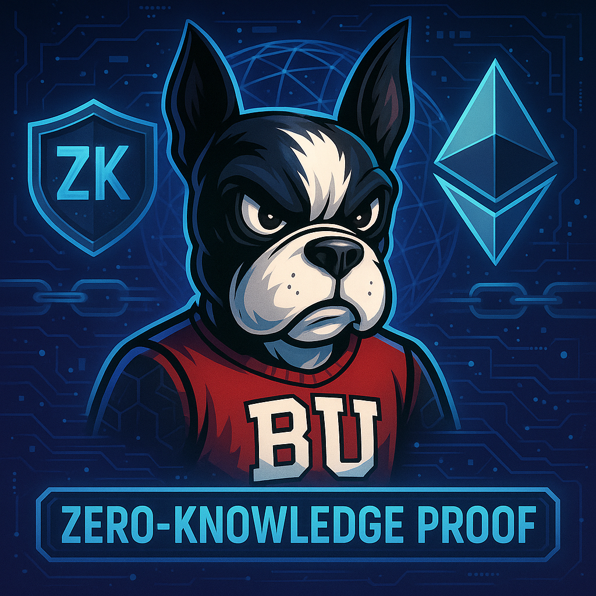

# Zero-Knowledge Proofs + Ethereum + BU Terrier

## Project Overview

This project combines the spirit of **Boston University** 🐾 with the cutting-edge technology of **Zero-Knowledge Proofs** and **Ethereum** 🔒⛓️.

We aim to explore privacy-enhancing cryptographic protocols, blockchain applications, and decentralized identity — all symbolized by our fierce and fearless mascot, **Rhett the Terrier**.

---

## Topics Covered
- Zero-Knowledge Proof Systems (ZKPs)
- Ethereum Smart Contracts
- Privacy and Scalability in Blockchain
- Cryptographic Protocols
- Decentralized Applications (dApps)

---

## Inspiration

Boston University's relentless pursuit of innovation meets the next frontier of cryptography and blockchain.  
Protect your identity, secure your data, and unleash your Terrier spirit!

---

## Quick Links
- [Learn more about Zero-Knowledge Proofs](https://zkproof.org/)
- [Ethereum Official Site](https://ethereum.org/)
- [Boston University Terrier Pride](https://www.bu.edu/terriers/)
